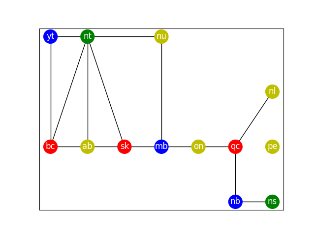

[](
  https://codespaces.new/dwave-examples/map-coloring?quickstart=1)
[](
  https://circleci.com/gh/dwave-examples/map-coloring)

# Map Coloring

A demo on using the D-Wave Ocean SDK to solve the map coloring problem. Namely,
given a map, color the regions of the map such that no two regions sharing a
border would share the same color.


  
A graph representation of the provinces of Canada. Provinces connected by edges
share a border together. This is a sample output produced by this demo.

## Usage

Simply run the code with

```bash
python map_coloring.py
```

## Code Overview

The idea is to describe the map coloring problem in terms of constraints.
Once this is done, we can use tools from the Ocean SDK to convert these
constraints into a binary quadratic model (BQM), a type of equation that can be
ingested by the quantum computer. Afterwards, we will hopefully have a solution
to our map coloring problem.

Constraints to describe the map coloring problem:

* Each region can only select one color
* No regions sharing a border can share a color

## Code Specifics

### Why only four colors?

* In the code, we let each of the regions choose one among four colors. Why
  are we limiting ourselves to only four colors? According to the [Four Colour
  Theorem](https://en.wikipedia.org/wiki/Four_color_theorem), we need no more
  than four colors to color any planar map such that no two adjacent regions
  share the same color

### Alternative implementation

* To solve the map coloring problem, in this demo, we are forming constraints,
  converting said constraints into a BQM, and then feeding said BQM to a solver.
  Please note, however, that the D-Wave Ocean stack also has a function called
  [min_vertex_color_qubo(..)][1] that will directly form the map coloring BQM
  for you.

## License

Released under the Apache License 2.0. See [LICENSE](./LICENSE) file.

[1]: https://docs.dwavequantum.com/en/latest/ocean/api_ref_dnx/generated/dwave_networkx.algorithms.coloring.min_vertex_color_qubo.html
